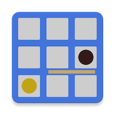

# Quoridor AI based on Monte Carlo Tree Search

[Quoridor](https://en.wikipedia.org/wiki/Quoridor) is an abstract strategy game played on a board of 81 (9x9) square spaces where the objective is to get your pawn to the opposite side of the board.

This AI agent playing Quoridor is based on [Monte Carlo tree search (MCTS)](https://en.wikipedia.org/wiki/Monte_Carlo_tree_search). Pure MCTS resulted in a poor performance. The performance was significantly improved after applying some heuristics. I added heuristics to the selection, expansion and simulation phase of the tree search (and also to post processes after search). You can see some of them on the "Some Heuristics Included" section below. If you want to see all the heuristics or their implementation details, refer to the comments in the source code. (Find the word "heuristic".)

You can play against this AI on the website (or web app) https://gorisanson.github.io/quoridor-ai/.

The number of rollouts per move for each AI level on the website is following.

| Level   | Rollouts per Move |
| -----   | ---- |
| Novice  | 2,500 |
| Average | 7,500 |
| Good    | 20,000 |
| Strong  | 60,000 |

## Some Heuristics Included in the latest version (v0.3)
* The branching factor of Quoridor is high due to a bunch of possible positions to place a wall. (There are 64 (8x8) possible positions if there is no wall on the board.) So I used a heuristic which only considers "probable" next walls to lower the branching factor. I used this heuristic on the selection/expansion phase and the rollout phase of MCTS. "Probable" next walls are the followings.
    
    1. Near the pawns (to disturb the opponent's pawn or support the player's pawn)
    1. Near the already placed walls
    1. Leftmost or rightmost horizontal walls

* On the rollout phase of MCTS, move the pawn to one of the shortest paths with a certain probability A. And with the rest probability 1-A, place a ("probable" next) wall randomly if there are walls left, otherwise, move the pawn backwards to give some penalty to having no left walls. (I set A = 0.7)

* On the selection/expansion phase of MCTS, if the opponent has no walls left, the player moves their pawn only to one of the shortest paths or places a wall only to interrupt the opponent's path (not to support their pawn). This heuristic lowers the branching factor on the end phase of a game.

* Some common openings are included. This heuristic is only effective less than 6 plies.  

## Previous Works

There are some previous works done by others.
(For available previous agents, I matched my agent against them to compare. You can see the results on the "Result" section below.)

* Victor Massagué Respall, Joseph Alexander Brown and Hamma Aslam. *[Monte Carlo Tree Search for Quoridor](https://www.researchgate.net/publication/327679826_Monte_Carlo_Tree_Search_for_Quoridor)*. 2018. - This paper led me to apply MCTS to my agent. Although I couldn't find the source code of the AI agent on this paper, just knowing the viability in advance was very encouraging to me.

* [Daniel Borowski's Quoridor AI](https://danielborowski.github.io/site/quoridor-ai/display.html) - It's hard for me to figure out his AI algorithm from his source code. But I could find [his comment on reddit](https://www.reddit.com/r/learnprogramming/comments/461woc/cminimax_implementation_for_quoridor/d01yo1m?utm_source=share&utm_medium=web2x) which says "I "sort of" implemented minimax with a depth of ~2 (hehe)."

* [Martijn van Steenbergen's SmartBrain 4](https://github.com/MedeaMelana/quoridorai) - This agent uses negamax of depth 4 with some heuristics (In his implementation, there are also SmartBrain 1, SmartBrain 2 and SmartBrain 3, each of which uses negamax of depth 1, 2 and 3 respectively. But, obviously, SmartBrain 4 is the strongest.)

## Results
The following tables is a comparison of my 60k agent (Strong) to other agent types. The agents from "2.5k agent (Novice)" to "180k agent" are all my AI agents with difference between them being the number of rollouts. For the 60k agent, half of the games were played as the light-colored pawn and the other half as the dark-colored pawn (assuming the light-colored pawn moves first). But against Dainel's Quoridor AI, the games were played as the light-colored pawn only, since his AI only takes the dark-colored pawn. Against Daniel's Quoridor AI and Martijin's SmartBrain 4, the matches are done manually by referring to the move from my 60k agent and playing it against them, and vice versa.

uctConst is the exploration parameter used in UCT(Upper Confidence Bound 1 applied to trees).

### Result of 60k v0.2 with uctConst = 0.5

| Opponent | Number of games played (as the light-colored / as the dark-colored for 60k) | Wins as the light-colored for 60k | Wins as the dark-colored for 60k | Percentage of Wins for 60k | Lower Confidence Bound (95%) | Upper Confidence Bound (95%)
| -------------------- | ----- | ---- | ---- | --- | --- | --- |
| 2.5k agent (Novice) v0.2  | 100 (50/50) | 46 | 38 | 84% | 75.3% | 90.6% |
| 7.5k agent (Average) v0.2 | 100 (50/50) | 39 | 36 | 75% | 65.3% | 83.1% |
| 20k agent (Good) v0.2     | 100 (50/50) | 31 | 33 | 64% | 53.8% | 73.4% |
| 120k agent v0.2          | 100 (50/50) | 26 | 25 | 51% | 40.8% | 61.1% |
| 180k agent v0.2           | 100 (50/50) | 23 | 20 | 43% | 33.1% | 53.3% |
| Daniel's Quoridor AI | 20 (20/0) | 15 | 0 | 75% | 50.9% | 91.3% | 
| Martijn's SmartBrain 4 | 10 (5/5) | 4 | 4 | 80% | 44.4% | 97.5% |

When I played against them by myself, I thought Martijn's SmartBrain 4 was stronger than Daniel's Quoridor AI. But, interestingly, the 60k agent seems to play better against Martijin's SmartBrain 4. In some matches, the play of Daniel's Quoridor AI somehow made the 60k agent exhaust walls too quickly and lose the game.

Martijn's implementation of Quoridor allows the diagonal jump even if there is not a wall or the board edge behind the pawn to be jumped. (The original Quoridor rule allows the diagonal jump "only if" there is a wall or the board edge behind the opponent's pawn to be jumped.) In a match against Martijn's SmartBrain 4, the 60k agent won the match although this out-of-the-rule diagonal jump was played twice by SmartBrain 4. This match is included on the statistics of the table above. And in another match, the out-of-the-rule diagonal jump was played by SmartBrain 4 when there were no left walls for both players and the win or lose was to be decided by whether the jump is accepted or not. So I nullified this match.

### Result of 60k v0.3 with uctConst = 0.2

| Opponent | Number of games played (as the light-colored / as the dark-colored for 60k) | Wins as the light-colored for 60k | Wins as the dark-colored for 60k | Percentage of Wins for 60k | Lower Confidence Bound (95%) | Upper Confidence Bound (95%)
| -------------------- | ----- | ---- | ---- | --- | --- | --- |
| 2.5k agent (Novice) v0.3  | 100 (50/50) | 48 | 50 | 98% | 93.0% | 99.8% |
| 7.5k agent (Average) v0.3 | 100 (50/50) | 43 | 39 | 82% | 73.1% | 89.0% |
| 20k agent (Good) v0.3     | 100 (50/50) | 32 | 26 | 58% | 47.7% | 67.8% |
| 60k agent (Strong) v0.2 with uctConst = 0.5     | 100 (50/50) | 37 | 30 | 67% | 56.9% | 76.1% |
| Daniel's Quoridor AI | 20 (20/0) | 18 | 0 | 90% | 68.3% | 98.8% | 
| Martijn's SmartBrain 4 | 4 (2/2) | 2 | 2 | 100% | 39.8% | 100% |

The 60k v0.3 agent won 67 out of 100 games against the 60k v0.2 agent. 

In a match against Martijn's SmartBrain 4, the 60k agent won the match although the out-of-the-rule diagonal jump was played once by SmartBrain 4. This match is included on the statistics of the table above.

## References

* Victor Massagué Respall, Joseph Alexander Brown and Hamma Aslam. *[Monte Carlo Tree Search for Quoridor](https://www.researchgate.net/publication/327679826_Monte_Carlo_Tree_Search_for_Quoridor)*. 2018.

* Levente Kocsis and Csaba Szepesva ́ri. *Bandit based Monte-Carlo Planning*. 2006.

* Peter Auer, Cesa-Bianchi and Fischer. *Finite-time Analysis of the Multiarmed Bandit Problem*. 2002.

